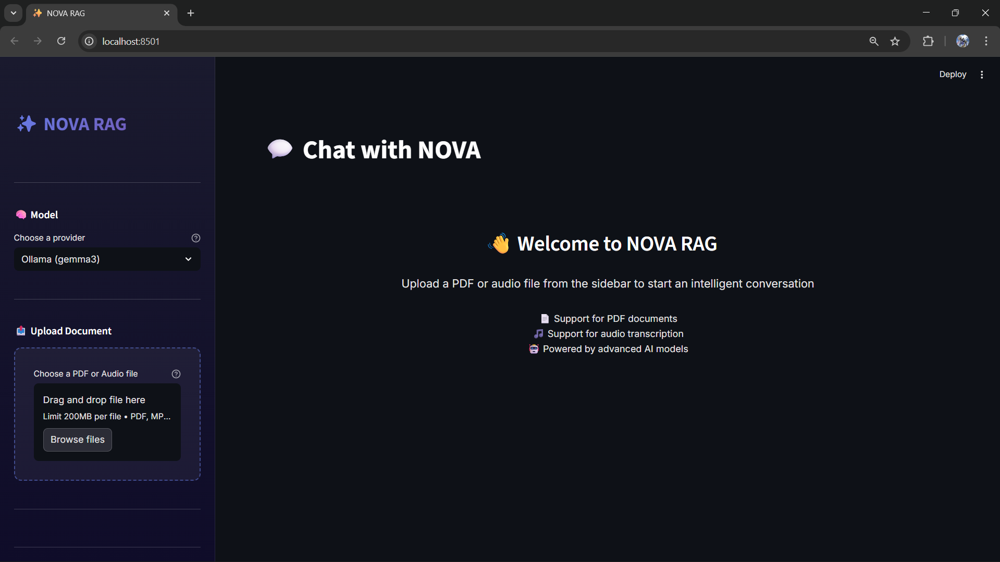
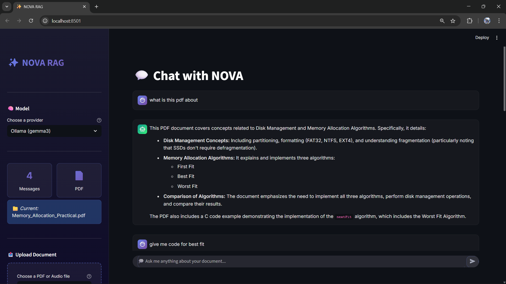

# ✨ NOVA RAG

A powerful Retrieval-Augmented Generation (RAG) application built with Streamlit that enables intelligent conversations with your documents. Upload PDFs or audio files and chat with an AI assistant that understands your content.



---

## 🚀 Features

### 📄 Document Processing
- **PDF Support**: Upload and process PDF documents with automatic text extraction
- **Audio Transcription**: Upload audio files (MP3, WAV, MPEG) and get them transcribed using Whisper AI
- **Smart Chunking**: Intelligent text splitting with overlap for better context retention
- **Vector Storage**: ChromaDB integration for efficient document retrieval

### 🤖 AI Models
- **Multiple LLM Providers**: Choose between Ollama (gemma3) or Google Gemini 2.5 Flash
- **Streaming Responses**: Real-time response generation for better user experience
- **Context-Aware**: Retrieves relevant document chunks based on your questions

### 🎨 Beautiful UI
- **Modern Design**: Gradient-based dark theme with smooth animations
- **Responsive Layout**: Wide layout optimized for conversations
- **Interactive Chat**: Streamlit chat interface with message history
- **Status Indicators**: Real-time processing status and progress updates



---

## 📋 Table of Contents

- [Installation](#installation)
- [Configuration](#configuration)
- [Usage](#usage)
- [Architecture](#architecture)
- [Features in Detail](#features-in-detail)
- [Technical Stack](#technical-stack)
- [Project Structure](#project-structure)
- [Troubleshooting](#troubleshooting)

---

## 🛠️ Installation

### Prerequisites

- Python 3.8 or higher
- CUDA-capable GPU (recommended for audio transcription)
- Ollama installed and running (for local LLM support)
- Google API key (optional, for Gemini support)

### Step 1: Clone the Repository

```bash
git clone <repository-url>
cd Nova Rag
```

### Step 2: Create Virtual Environment

```bash
python -m venv venv
```

**Windows:**
```bash
venv\Scripts\activate
```

**Linux/Mac:**
```bash
source venv/bin/activate
```

### Step 3: Install Dependencies

```bash
pip install -r requirements.txt
```

### Step 4: Install Ollama (for Local LLM)

Download and install Ollama from [ollama.ai](https://ollama.ai), then pull the required models:

```bash
ollama pull gemma3
ollama pull nomic-embed-text
```


---

## ⚙️ Configuration

### Environment Setup

The application uses an API key for Google Gemini. Update `env.py` with your Google API key:

```python
def get_api():
    return "YOUR_GOOGLE_API_KEY_HERE"
```

**Note**: For production use, consider using environment variables instead of hardcoding the API key.

### Model Configuration

You can switch between LLM providers in the sidebar:
- **Ollama (gemma3)**: Local, free, requires Ollama running
- **Gemini 2.5 Flash**: Cloud-based, requires API key

---

## 📖 Usage

### Starting the Application

```bash
streamlit run main.py
```

The application will open in your default browser at `http://localhost:8501`.

### Uploading Documents

1. **PDF Documents**:
   - Click "Choose a PDF or Audio file" in the sidebar
   - Select your PDF file
   - Click "🚀 Process PDF"
   - Wait for processing to complete


2. **Audio Files**:
   - Click "Choose a PDF or Audio file" in the sidebar
   - Select your audio file (MP3, WAV, or MPEG)
   - Click "🚀 Process Audio"
   - Wait for transcription and processing to complete


### Chatting with Your Documents

Once a document is processed:

1. Type your question in the chat input at the bottom
2. Press Enter or click Send
3. The AI will search through your document and provide an answer
4. Continue the conversation with follow-up questions


### Managing Conversations

- **Clear Chat**: Click "🗑 Clear Chat" in the sidebar to reset the conversation
- **Switch Documents**: Upload a new document to replace the current one
- **View Stats**: Check message count and document type in the sidebar stats


---

## 🏗️ Architecture

### System Overview

```
┌─────────────────┐
│   User Input    │
└────────┬────────┘
         │
         ▼
┌─────────────────┐
│  Document Upload│
│  (PDF/Audio)    │
└────────┬────────┘
         │
    ┌────┴────┐
    │         │
    ▼         ▼
┌───────┐ ┌──────────┐
│  PDF  │ │  Audio   │
│Loader │ │Transcribe│
└───┬───┘ └─────┬────┘
    │           │
    └─────┬─────┘
          │
          ▼
┌─────────────────┐
│ Text Splitting  │
│  (Chunking)     │
└────────┬────────┘
         │
         ▼
┌─────────────────┐
│   Embeddings    │
│  (nomic-embed)  │
└────────┬────────┘
         │
         ▼
┌─────────────────┐
│  ChromaDB       │
│  Vector Store   │
└────────┬────────┘
         │
         ▼
┌─────────────────┐
│   Retrieval     │
│   (MMR Search)  │
└────────┬────────┘
         │
         ▼
┌─────────────────┐
│  LLM (Ollama/   │
│    Gemini)      │
└────────┬────────┘
         │
         ▼
┌─────────────────┐
│  Response       │
│  (Streaming)    │
└─────────────────┘
```

### Key Components

1. **Document Processing Pipeline**
   - PDF: PyMuPDF → Text Splitter → Embeddings → Vector Store
   - Audio: Whisper → Transcription → Text Splitter → Embeddings → Vector Store

2. **Retrieval System**
   - Uses Maximum Marginal Relevance (MMR) search
   - Retrieves top 8 relevant chunks per query
   - Maintains context across conversation

3. **Response Generation**
   - Streaming responses for real-time feedback
   - Context-aware answers using retrieved chunks
   - Supports multiple LLM backends


---

## 🔍 Features in Detail

### Document Processing

#### PDF Processing
- Uses PyMuPDF for efficient PDF text extraction
- Recursive character text splitter with 800-character chunks
- 200-character overlap between chunks for context preservation

#### Audio Processing
- Faster Whisper (large-v3) model for transcription
- CUDA acceleration for faster processing
- Supports multiple audio formats (MP3, WAV, MPEG)
- Character-based text splitting optimized for transcriptions

### Vector Storage

- **ChromaDB**: Lightweight, in-memory vector database
- **Embeddings**: Nomic Embed Text model via Ollama
- **Search**: MMR (Maximum Marginal Relevance) for diverse, relevant results

### LLM Integration

#### Ollama (Local)
- Model: `gemma3`
- Runs entirely on your machine
- No API costs
- Requires Ollama service running

#### Google Gemini
- Model: `gemini-2.5-flash`
- Cloud-based, fast responses
- Requires API key
- Better for production use

### User Interface

- **Streamlit Framework**: Modern, interactive web interface
- **Custom Styling**: Gradient themes, smooth animations
- **Real-time Updates**: Status indicators and progress bars
- **Chat Interface**: Natural conversation flow

---

## 🛠️ Technical Stack

### Core Libraries

- **Streamlit** (1.50.0): Web framework for the UI
- **LangChain** (0.3.27): RAG framework and document processing
- **LangChain Community** (0.3.30): Community integrations
- **ChromaDB** (1.1.1): Vector database
- **Ollama** (0.6.0): Local LLM integration
- **Faster Whisper** (1.2.1): Audio transcription
- **PyMuPDF** (1.26.4): PDF processing

### AI Models

- **Embeddings**: `nomic-embed-text` (via Ollama)
- **LLM Options**:
  - `gemma3` (via Ollama)
  - `gemini-2.5-flash` (via Google)

### Dependencies

See `requirements.txt` for the complete list of dependencies.

---

## 📁 Project Structure

```
12_nova_rag/
│
├── main.py              # Main Streamlit application
├── prompt.py            # RAG prompt template
├── stt.py               # Speech-to-text (Whisper) module
├── env.py               # API key configuration
├── requirements.txt     # Python dependencies
├── README.md           # This file
│
├── screenshots/        # Screenshot directory (to be added)
│   ├── main-dashboard.png
│   ├── chat-interface.png
│   ├── pdf-upload.png
│   ├── audio-upload.png
│   ├── question-answering.png
│   ├── model-selection.png
│   ├── conversation-management.png
│   ├── installation.png
│   ├── architecture.png
│   └── ui-components.png
│
└── venv/               # Virtual environment (not in git)
```

### File Descriptions

- **main.py**: Contains the Streamlit UI, document processing functions, RAG pipeline, and chat interface
- **prompt.py**: Defines the RAG prompt template used for generating responses
- **stt.py**: Handles audio transcription using Faster Whisper
- **env.py**: Manages API key retrieval (currently hardcoded, should use env vars in production)

---

## 🎯 Use Cases

- **Research Papers**: Upload academic papers and ask questions about the content
- **Meeting Transcripts**: Transcribe audio recordings and query important points
- **Documentation**: Process technical documentation and get instant answers
- **Educational Content**: Study materials and lecture recordings
- **Business Reports**: Analyze PDF reports and extract insights

---

## 🐛 Troubleshooting

### Common Issues

#### 1. Ollama Connection Error
**Problem**: "Connection refused" when using Ollama model

**Solution**:
- Ensure Ollama is running: `ollama serve`
- Verify models are installed: `ollama list`
- Pull missing models: `ollama pull gemma3`

#### 2. Audio Transcription Fails
**Problem**: Audio processing errors or slow transcription

**Solution**:
- Ensure CUDA is available: `nvidia-smi`
- Check Faster Whisper installation
- Try reducing audio file size or quality

#### 3. ChromaDB Errors
**Problem**: Vector store creation fails

**Solution**:
- Ensure ChromaDB is properly installed
- Check available disk space
- Restart the application

#### 4. API Key Issues
**Problem**: Gemini model not working

**Solution**:
- Verify API key in `env.py`
- Check API key permissions
- Ensure billing is enabled for Google Cloud

---

## 🔒 Security Notes

⚠️ **Important**: The current implementation stores the API key directly in `env.py`. For production use:

1. Use environment variables:
```python
import os
def get_api():
    return os.getenv("GOOGLE_API_KEY")
```

2. Create a `.env` file (and add it to `.gitignore`):
```
GOOGLE_API_KEY=your_key_here
```

3. Use `python-dotenv` to load it:
```python
from dotenv import load_dotenv
load_dotenv()
```

---

## 🚀 Future Enhancements

- [ ] Support for more document formats (DOCX, TXT, Markdown)
- [ ] Multi-document chat sessions
- [ ] Export conversation history
- [ ] Advanced search filters
- [ ] Custom chunking strategies
- [ ] Batch document processing
- [ ] User authentication
- [ ] Persistent vector stores

---

## 📝 License

[Add your license information here]

---

## 👥 Contributing

Contributions are welcome! Please feel free to submit a Pull Request.

---

## 🙏 Acknowledgments

- **LangChain** for the RAG framework
- **Ollama** for local LLM support
- **Streamlit** for the web framework
- **Faster Whisper** for audio transcription
- **ChromaDB** for vector storage

---

## 📧 Contact

[Add your contact information here]

---

**Made with ❤️ using Streamlit, LangChain, and Ollama**

